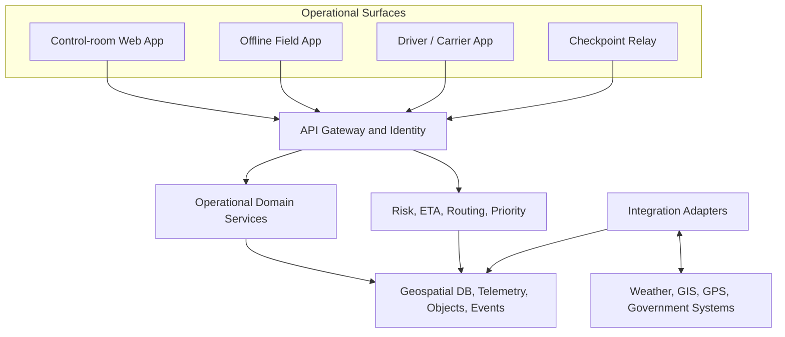
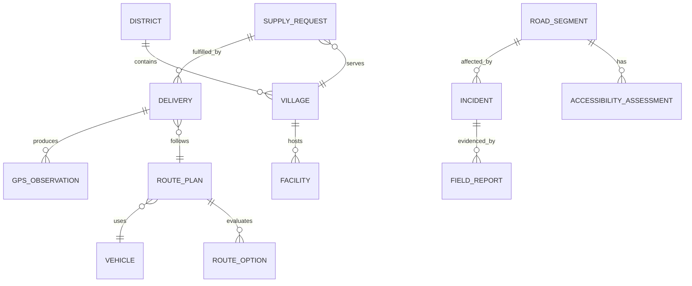
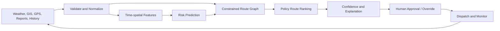
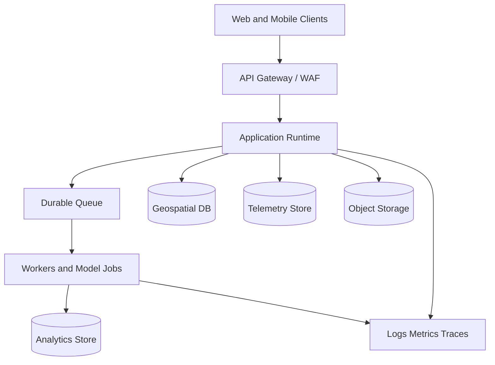

# Architecture and System Design

## 1. Design Intent

This is the technical companion to [BRD.md](BRD.md) for NER Sahayak, the solution for Problem Statement ID26002.

**Architecture invariant:** no recommendation is valid without freshness, provenance, confidence, explainability, and human accountability. AI predicts and ranks; rules enforce safety boundaries; authorized people approve operational actions.

## 2. Architecture Principles

1. Offline-first field operation.
2. Risk before distance.
3. Human approval for high-impact actions.
4. Evidence and provenance for every operational observation.
5. Event-oriented changes with append-only audit history.
6. External systems isolated behind replaceable adapters.
7. Models cannot override closures, restrictions, or approval policies.
8. Graceful degradation from live services to cached data and relay procedures.
9. Least-privilege access by organization and district.

## 3. Logical Architecture



## 4. Domain Boundaries

| Boundary | Owns |
|---|---|
| Identity and Governance | Users, organizations, roles, approvals, configuration, audits |
| Network and GIS | Districts, villages, facilities, roads, bridges, hubs, helipads, geometry, accessibility, freshness |
| Incident and Evidence | Incidents, field reports, photos, validation, source reliability, conflicts |
| Supply and Demand | Requests, commodities, inventory, beneficiary criticality, destination readiness |
| Planning and Dispatch | Vehicles, capabilities, route plans, stops, hubs, wait/reroute decisions, approvals |
| Tracking and Delivery | GPS, checkpoints, progress, delivery confirmation, proof, delay reasons |
| Intelligence | Features, risk, ETA, priority, route ranking, confidence, explanations, model versions |
| Notification and Escalation | Alert rules, recipients, multilingual messages, acknowledgement, retries, escalation |

The MVP may deploy these modules as a modular monolith. The interfaces and event contracts must remain separable for later scaling.

## 5. Service Responsibilities

| Service | Main responsibility |
|---|---|
| Identity | Authentication and scoped authorization |
| Network | GIS entities, accessibility, route graph metadata |
| Incident | Evidence, validation, freshness, conflicts |
| Request | Supply needs, stock, priority inputs |
| Planning | Feasible route plans, hubs, dispatch state |
| Risk | Hazard features, risk bands, forecasts |
| Routing/ETA | Constrained alternatives and travel-time estimates |
| Tracking | GPS, checkpoint, vehicle, and delivery events |
| Sync | Offline command queue, conflicts, idempotency |
| Alerts | Notification fan-out, acknowledgement, escalation |
| Reporting | Dashboards, exports, audit and performance views |
| Integration Gateway | Provider adapters, retries, health, source mapping |

## 6. Data Architecture

- A geospatial relational store holds operational entities, geometries, route metadata, and audit references.
- Object storage holds photographs, documents, cached map packages, and model artifacts.
- A time-series store holds GPS and weather observations.
- A durable queue or event stream carries incidents, accessibility changes, route recalculations, alerts, and synchronization batches.
- An analytics store holds historical deliveries, disruption outcomes, model evaluation, and investment views.
- The mobile client holds an encrypted local database with cached assigned-corridor data and an outbound queue.

### Canonical event envelope

```json
{
  "event_id": "uuid",
  "event_type": "RoadAccessibilityChanged",
  "occurred_at": "timestamp",
  "received_at": "timestamp",
  "source": {"type": "field_report", "id": "source-id"},
  "actor_id": "uuid-or-system",
  "correlation_id": "incident-or-delivery-id",
  "schema_version": 1,
  "payload": {}
}
```

Events are append-only. Current state is a projection. Corrections create compensating events and preserve the original report.

### Entity relationship



## 7. Risk, Priority, and Route Engine



Risk output must contain segment, time window, risk band, probability band, confidence, hazards, contributing factors, model version, and advisory-only status. `unknown` is used when evidence is insufficient; it is never silently converted to low risk. A verified closure supersedes a model result.

The priority score is explainable and configurable:

`priority = criticality + affected_population + stockout_risk + isolation + urgency - available_local_supply`

Route candidates are filtered first by active closure, vehicle restrictions, authority restrictions, unavailable bridges, and missing emergency approval. Remaining routes are ranked using ETA, delay, risk, distance, reliability, resource cost, and return-trip feasibility. The UI displays each tradeoff.

## 8. Offline and Low-Connectivity Design

The mobile application stores an encrypted operational subset, last approved plan, cached map corridor, append-only outbound command queue, synchronization cursor, and conflict state.

1. Every command has a client-generated idempotency key.
2. Retries never duplicate incidents, deliveries, or alerts.
3. Safety-critical conflicts become review tasks rather than silent merges.
4. Source authority and freshness matter alongside timestamps.
5. Photos upload resumably and separately from metadata.
6. The client shows last synchronization time and stale-plan warnings.
7. Checkpoint relay exchanges signed short-form updates; relay staff cannot approve high-risk actions without assigned authority.

## 9. API and Integration Design

Use versioned REST APIs for transactions and mobile synchronization, live-update channels where available, batch import/export for legacy systems, and signed webhooks for approved notifications. All public contracts should be described in OpenAPI and tested in CI.

```text
External Provider -> Adapter -> Validation -> Canonical Event -> Projection
```

Adapters must expose source identity, mapping version, health, rate-limit handling, retry policy, and dead-letter records. The platform must remain demonstrable with simulated or manual data when an adapter is unavailable.

## 10. Security and Privacy

- OIDC-compatible identity and MFA for privileged users.
- District and organization authorization at API and query layers.
- Short-lived tokens, managed secrets, encryption in transit and at rest.
- Append-only audit storage with restricted access.
- File type validation and malware scanning for uploads.
- Rate limiting, input validation, replay protection, and sync idempotency.
- Separation of personal data from operational map projections.
- Location masking for reports that do not need exact coordinates.
- Defined backup, recovery, retention, and incident-response procedures before production.

## 11. Deployment Topology



Environments are development, test, staging/pilot, and production. Production data must not be copied into development. Infrastructure and database migrations should be versioned and automated. Cloud provider, government hosting, residency, and disaster-recovery targets remain open decisions.

## 12. Observability and Model Operations

Monitor API latency, errors, queue lag, synchronization, notifications, GPS freshness, integrations, route recalculations, overrides, stale data, conflicts, false alerts, model calibration, and data drift. Every model must have a version, training-data range, features, evaluation, approval state, and rollback path. Until adequate historical data exists, rules plus advisory predictions remain the production decision path.

## 13. Failure and Degradation Modes

| Failure | Behavior |
|---|---|
| Weather provider down | Use last valid data with freshness warning; disable new forecast claims |
| GPS provider down | Show last known position and stale status; allow manual updates |
| Map service down | Use cached graph/map; prevent unsupported route claims |
| Mobile offline | Queue reports and show last approved plan |
| Conflicting reports | Mark segment disputed and request review |
| Model unavailable | Use rules and known accessibility with lower confidence |
| Notification provider down | Retry, switch configured channel, escalate in control room |
| Incomplete air-delivery data | Create approval task; never auto-dispatch |

## 14. Testing Strategy

Unit-test scoring, thresholds, hard constraints, freshness, localization, and idempotency. Add API and adapter contract tests, GIS tests for disconnected graphs and restrictions, offline tests for 72-hour queueing and conflicts, scenario tests for landslide/flood/bridge/no-alternate/wait/hub/air escalation, load tests for routes/GPS/alerts, security tests for authorization and uploads, and human acceptance tests with officers, field staff, drivers, and receivers.

## 15. Release Plan

1. **Demonstrator:** seeded GIS, simulated feeds, priority, route alternatives, dashboard, audit.
2. **Pilot:** offline field reports, synchronization, GPS, alerts, real selected feeds, multilingual and hub workflows.
3. **Expansion:** calibrated hazard models, imagery, infrastructure analytics, additional integrations, and multi-state scale.

## 16. Adopted and Deferred Decisions

### Adopted

- Modular domain architecture with event-oriented integration.
- Offline-first mobile operation.
- Geospatial data as a first-class concern.
- Explainable policy for MVP priority and route ranking.
- Rules as the safety boundary around advisory ML.
- Human approval for high-risk dispatch and air escalation.
- External systems isolated behind adapters.

### Deferred

- Government hosting and cloud provider.
- Exact map, weather, GPS, messaging, and imagery providers.
- ML model family and training strategy after data assessment.
- Final languages and translation ownership.
- Data retention, residency, classification, RPO/RTO.
- Checkpoint transport: SMS, radio, Bluetooth, or government field network.
