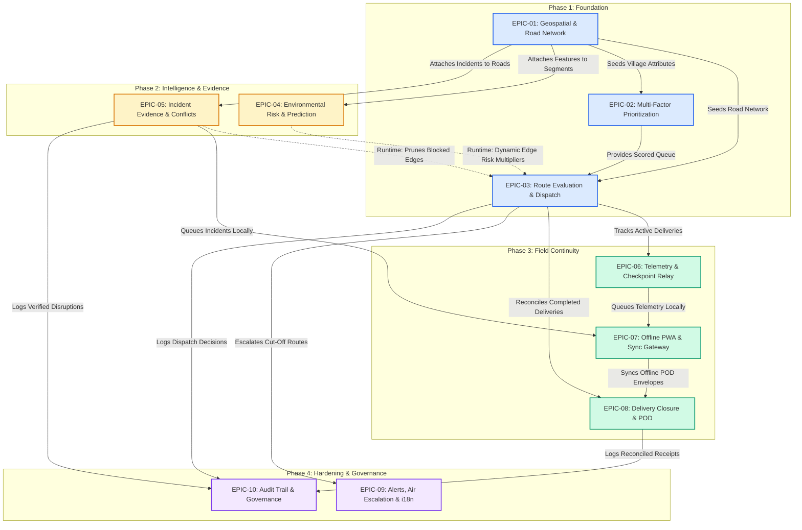

# NER Sahayak — Epics and Stories
**SIH Problem Statement:** SIH26002 (Ministry of Development of North Eastern Region — MDoNER)  
**Methodology:** BMAD Agile Architecture & Decomposition  
**Status:** Approved Specification  
**Artifact Location:** `_bmad-output/planning-artifacts/epics.md`

---

## Executive Overview

NER Sahayak is an operational logistics and accessibility intelligence platform engineered for the fragile, disaster-prone terrain of the North Eastern Region. 

This document defines the complete epic and user story backlog for evolving the existing prototype into the target SIH26002 system. It preserves the verified NetworkX routing core, PostGIS spatial foundation, and FastAPI JWT authentication while implementing authentic East Khasi Hills geography, multi-factor supply prioritization, dynamic environmental disruption prediction, offline-first field operations, and human-in-the-loop governance.

---

## Phase Summary & Epic Catalog

```
Phase 1: Critical Demonstration Foundation
  ├── EPIC-01: Authentic Geospatial Foundation & Road Network Overlay
  │     ├── STORY-01.1: Authentic East Khasi Hills PostGIS Road Network Seeding
  │     └── STORY-01.2: Dynamic GeoJSON Road Accessibility Map Visualization
  ├── EPIC-02: Multi-Factor Supply Prioritization & Intake
  │     ├── STORY-02.1: Multi-Factor Priority Calculation Engine
  │     └── STORY-02.2: Prioritized Request Queue & Justified Override UI
  └── EPIC-03: Connected Route Evaluation & Dispatch Decision Support
        ├── STORY-03.1: Route Evaluation Service & Multi-Alternative Ranking
        └── STORY-03.2: Connected Dispatch Workflow & Approval Modal

Phase 2: Environmental Intelligence, Prediction & Incident Evidence
  ├── EPIC-04: Environmental Intelligence & Disruption Risk Prediction
  │     ├── STORY-04.1: Environmental Ingestion & Spatial-Temporal Feature Aggregator
  │     ├── STORY-04.2: Road Disruption Risk Prediction & Advisory Explanation Service
  │     └── STORY-04.3: Risk-Aware Route Ingestion & Adaptive Policy Routing
  └── EPIC-05: Incident Lifecycle, Evidence & Conflict Management
        ├── STORY-05.1: Geo-Tagged Field Incident Reporting with Photo Evidence
        └── STORY-05.2: Disputed Segment Conflict Triage & Dynamic Graph Re-evaluation

Phase 3: Field Operations, Continuity & Delivery Closure
  ├── EPIC-06: Telemetry, Checkpoint Relay & Progress Monitoring
  │     ├── STORY-06.1: Source-Agnostic Telemetry & Checkpoint Relay Ingestion
  │     └── STORY-06.2: Live Corridor Tracking & Route Deviation Detection
  ├── EPIC-07: Offline-First Field PWA & Idempotent Synchronization
  │     ├── STORY-07.1: Client-Side IndexedDB Offline Action Queue & Service Worker
  │     └── STORY-07.2: Idempotent Batch Sync Endpoint with Conflict Resolution
  └── EPIC-08: Delivery Closure & Photo-Verified Proof of Delivery
        ├── STORY-08.1: Proof of Delivery (POD) Receipt with Discrepancy Capture
        └── STORY-08.2: Delivery Reconciliation & Request Lifecycle Completion

Phase 4: Operational Hardening, Governance & Localization
  ├── EPIC-09: Proactive Alerting, Air Escalation & Multilingual Messaging
  │     ├── STORY-09.1: Corridor Disruption Alerting & Air-Delivery Escalation Gate
  │     └── STORY-09.2: Multilingual Support for NER Languages (Khasi, Assamese, Hindi)
  └── EPIC-10: Tamper-Evident Auditability & Operational Governance
        ├── STORY-10.1: Structured Canonical Event Auditing & Causal Event Chain
        └── STORY-10.2: Control-Room Audit Inspector & Operational Report Export
```

---

# Detailed Epics & User Stories

## EPIC-01: Authentic Geospatial Foundation & Road Network Overlay

* **Epic ID:** `EPIC-01`
* **Epic Name:** Authentic Geospatial Foundation & Road Network Overlay
* **Business / Operational Objective:** Ground the entire platform in an authentic North Eastern Region road network (East Khasi Hills / Shillong–Dawki–Cherrapunji corridors), rendering real-time operational accessibility states directly on the control-room map.
* **Why Required for SIH26002:** Demonstrating a platform for MDoNER using Central Delhi coordinates invalidates the core premise of the hackathon. Evaluators must see genuine NER topography, river crossings, and mountain highway topologies.
* **Current-State Starting Point:** `seed.py` seeds Delhi coordinates (`77.2090° E, 28.6139° N`). `App.jsx` renders static node markers from a hardcoded JS object and never visualizes road linestrings.
* **Target Outcome:** PostGIS database seeded with verified East Khasi Hills settlements, critical bridges, and road geometries. Web GIS map fetches and renders interactive, color-coded road segments (Open, Restricted, Hazardous, Blocked).
* **Dependencies:** None (Baseline foundation).
* **Priority:** Critical

---

### STORY-01.1: Authentic East Khasi Hills PostGIS Road Network Seeding

* **Story ID:** `STORY-01.1`
* **Story Name:** Authentic East Khasi Hills PostGIS Road Network Seeding
* **User / Persona:** System Administrator / Control-Room Operator
* **User Story:** As a control-room operator, I want the platform seeded with authentic East Khasi Hills settlements, highways (NH-06 / SH-5), bridges, and elevation corridors, so that all logistics calculations reflect real mountain terrain conditions.
* **Current Gap Being Solved:** `ner_sahayak_backend/app/seed.py` defines 6 mock nodes situated in Central Delhi with synthetic Euclidean distances.
* **Acceptance Criteria:**
  1. `seed.py` seeds at least 12 genuine settlements in Meghalaya (e.g., Shillong HQ, Upper Shillong Depot, Sohra/Cherrapunji, Pynursla, Dawki Border Post, Mawphlang, Mawsynram, Nongpoh).
  2. Geographic coordinates strictly lie within Meghalaya bounds (`91.5° E to 92.2° E`, `25.1° N to 25.8° N`).
  3. Seeds at least 16 interconnecting road segments with authentic `LINESTRING` geometries in EPSG:4326.
  4. Includes explicit bridge attributes (`is_bridge=True`, `max_vehicle_weight_kg=12000`, `max_vehicle_height_m=3.8`) for key river crossings (e.g., Umngot Bridge at Dawki).
  5. Seeds baseline users, vehicles (Light 4x4, 10-Ton Truck), and relief depots.
* **Technical Scope:**
  * **Backend Impact:** Refactor `ner_sahayak_backend/app/seed.py` with verified GeoJSON/WKT geometries and realistic travel times based on mountain road speeds (25–35 km/h).
  * **Frontend Impact:** None (backend data seeding).
  * **Database Impact:** Populates `villages`, `road_segments`, `users` with valid PostGIS spatial entities.
  * **External Integration Impact:** None (offline verified coordinates).
  * **Security / Authorization:** Restricted to database initialization.
  * **Offline Considerations:** N/A.
  * **Dependencies:** None.
* **Definition of Done:** `docker-compose down -v && docker-compose up --build` seeds the database cleanly; running SQL `ST_AsGeoJSON(geom)` returns valid coordinates situated in East Khasi Hills.

---

### STORY-01.2: Dynamic GeoJSON Road Accessibility Map Visualization

* **Story ID:** `STORY-01.2`
* **Story Name:** Dynamic GeoJSON Road Accessibility Map Visualization
* **User / Persona:** Control-Room Officer
* **User Story:** As a control-room officer, I want to see the entire road network rendered on the map with color-coded operational accessibility states, so that I can immediately spot blocked and hazardous corridors.
* **Current Gap Being Solved:** `App.jsx` has a hardcoded `VILLAGES` dictionary in JS state. Road linestrings are never queried or drawn on Leaflet; only isolated points appear.
* **Acceptance Criteria:**
  1. Backend exposes `GET /api/v1/roads/geojson` returning a FeatureCollection of all road segments with properties: `id`, `name`, `accessibility_state`, `risk_level`, `is_bridge`, `max_vehicle_weight_kg`.
  2. Frontend Leaflet map centers on Meghalaya (`25.5788° N, 91.8933° E`, zoom level 10) instead of Delhi.
  3. Roads are rendered as interactive vector lines with distinct color coding:
     * Green (`#10b981`) = `open`
     * Amber (`#f59e0b`) = `hazardous`
     * Purple (`#8b5cf6`) = `restricted`
     * Red (`#ef4444`) = `blocked`
  4. Clicking any road segment opens a popup displaying segment name, current status, bridge constraints, and last updated timestamp.
* **Technical Scope:**
  * **Backend Impact:** Implement `GET /api/v1/roads/geojson` in `main.py` using GeoAlchemy2/PostGIS `ST_AsGeoJSON`.
  * **Frontend Impact:** Remove hardcoded `VILLAGES` in `App.jsx`. Fetch GeoJSON from backend on mount; render using `react-leaflet` `<GeoJSON />` component with dynamic style functions and popup binders.
  * **Database Impact:** Spatial index `idx_road_segments_geom` verified on geometry column.
  * **External Integration Impact:** OpenStreetMap / CartoDB tile layer.
  * **Security / Authorization:** Accessible to authenticated roles (`control_room`, `field_officer`).
  * **Offline Considerations:** Fallback to cached GeoJSON in `localStorage` if network fails.
  * **Dependencies:** `STORY-01.1`.
* **Definition of Done:** Opening the dashboard immediately displays the real East Khasi Hills road network with roads distinctly colored by operational status. Clicking a road displays its real-time attributes.

---

## EPIC-02: Multi-Factor Supply Prioritization & Intake

* **Epic ID:** `EPIC-02`
* **Epic Name:** Multi-Factor Supply Prioritization & Intake
* **Business / Operational Objective:** Replace the binary priority score with a multi-factor ranking model accounting for population vulnerability, stockout risk, isolation, and urgency.
* **Why Required for SIH26002:** In disaster-prone hilly regions, emergency supplies cannot be allocated on a simple first-come, first-served basis. A remote cutoff hamlet needing emergency saline must outrank a well-connected depot needing routine replenishment.
* **Current-State Starting Point:** `main.py:68` hardcodes: `db_request.priority_score = 75.5 if req.urgency == 'emergency' else 10.0`.
* **Target Outcome:** Algorithmic calculation of request priority adhering to the PRD formula, complete with transparent factor breakdowns and justified dispatcher overrides.
* **Dependencies:** `EPIC-01`.
* **Priority:** High

---

### STORY-02.1: Multi-Factor Priority Calculation Engine

* **Story ID:** `STORY-02.1`
* **Story Name:** Multi-Factor Priority Calculation Engine
* **User / Persona:** District Logistics Officer
* **User Story:** As a district logistics officer, I want supply requests scored using a composite model of urgency, criticality, population, isolation, and stockout risk, so that the most vulnerable populations are served first.
* **Current Gap Being Solved:** Simple binary float scoring in `main.py` ignores all contextual risk indicators.
* **Acceptance Criteria:**
  1. Priority formula implemented according to PRD/BRD specification:
     $$\text{Score} = w_u \cdot U + w_c \cdot C + w_p \cdot \log_{10}(P) + w_i \cdot I + w_s \cdot S - w_l \cdot L$$
     * $U$ = Urgency (Routine: 10, Urgent: 30, Emergency: 60)
     * $C$ = Commodity Criticality (Medical/Blood/O2: 30, Drinking Water: 25, Food: 15, General: 5)
     * $P$ = Village Population
     * $I$ = Village Isolation Score (0.0 to 1.0, based on distance & alternate road count)
     * $S$ = Stockout Risk (0 to 20, based on remaining days of supply)
     * $L$ = Available Local Supply (0 to 15)
  2. Request creation endpoint (`POST /api/v1/requests`) automatically calculates and stores `priority_score` (normalized 0–100) and saves the breakdown JSON in `priority_breakdown`.
  3. `GET /api/v1/requests` orders requests descending by `priority_score`.
* **Technical Scope:**
  * **Backend Impact:** Create `app/priority_engine.py` with unit tests for score edge cases. Update `POST /api/v1/requests` to ingest new parameters and calculate scores dynamically.
  * **Frontend Impact:** Update request submission form to accept commodity category and days of stock remaining.
  * **Database Impact:** Add `commodity_category`, `stockout_days`, and `priority_breakdown` (JSON) columns to `supply_requests`.
  * **External Integration Impact:** None.
  * **Security / Authorization:** Authorized roles (`village_rep`, `control_room`).
  * **Offline Considerations:** N/A.
  * **Dependencies:** `STORY-01.1`.
* **Definition of Done:** Submitting a request for an isolated village of 5,000 people with 0 days of oxygen yields a score of 90+, reliably ranking above a routine food request from an accessible urban center.

---

### STORY-02.2: Prioritized Request Queue & Justified Override UI

* **Story ID:** `STORY-02.2`
* **Story Name:** Prioritized Request Queue & Justified Override UI
* **User / Persona:** Control-Room Dispatcher
* **User Story:** As a control-room dispatcher, I want to inspect the prioritized request queue, view the mathematical score breakdown, and apply a reasoned manual override when local conditions require it.
* **Current Gap Being Solved:** The UI only shows commodity and quantity in raw format without breakdown or override capability.
* **Acceptance Criteria:**
  1. Control-room view renders supply requests ranked by priority score with high-contrast priority chips (Critical >80, Urgent 50-79, Routine <50).
  2. Hovering or clicking the score displays an explanatory tooltip showing the contribution of each factor (Isolation, Stockout, Criticality).
  3. Dispatcher can click "Override Priority" and enter a new score with a **mandatory text reason** (minimum 15 characters).
  4. Overrides trigger a backend `PATCH /api/v1/requests/{id}/override` endpoint, updating the score and appending a `PriorityOverridden` event to `EventLog` with actor ID and reason.
* **Technical Scope:**
  * **Backend Impact:** Create endpoint `PATCH /api/v1/requests/{id}/override` requiring `new_score` and `override_reason`. Record event in `EventLog`.
  * **Frontend Impact:** Build `PriorityScoreBadge` component with breakdown popover and modal dialog for manual override in `App.jsx`.
  * **Database Impact:** Add `is_overridden` (Boolean) and `override_reason` (String) to `supply_requests`.
  * **External Integration Impact:** None.
  * **Security / Authorization:** Restricted strictly to `control_room` role.
  * **Offline Considerations:** None.
  * **Dependencies:** `STORY-02.1`.
* **Definition of Done:** Dispatcher can view exact score math, override a request with an audit rationale, and observe the queue immediately reorder with an audit entry generated.

---

## EPIC-03: Connected Route Evaluation & Dispatch Decision Support

* **Epic ID:** `EPIC-03`
* **Epic Name:** Connected Route Evaluation & Dispatch Decision Support
* **Business / Operational Objective:** Replace the mocked frontend dispatch timer with full end-to-end integration to `graph_engine.py`, enabling interactive multi-route comparison, safety constraint auditing, and verified dispatch approval.
* **Why Required for SIH26002:** The routing engine is the intellectual core of the project. In the current prototype, the frontend completely bypasses it via `setTimeout`. The full decision-support loop must be demonstrable live.
* **Current-State Starting Point:** `graph_engine.py` possesses working graph pruning, Yen's K-shortest paths, and confidence scoring. `App.jsx:170-199` fakes dispatch with `setTimeout` and never calls the backend API.
* **Target Outcome:** The dispatcher clicks "Evaluate Route", the system calls `graph_engine.py` via an evaluation endpoint, renders K-alternative paths on the Leaflet map with tradeoffs, and commits the approved dispatch to the database.
* **Dependencies:** `EPIC-01`, `EPIC-02` (Implementation dependencies).
* **Priority:** Critical

---

### STORY-03.1: Route Evaluation Service & Multi-Alternative Ranking

* **Story ID:** `STORY-03.1`
* **Story Name:** Route Evaluation Service & Multi-Alternative Ranking
* **User / Persona:** Control-Room Dispatcher
* **User Story:** As a dispatcher, I want to evaluate feasible routes for a supply request before committing dispatch, seeing candidate alternatives, pruned hazards, ETAs, and confidence scores.
* **Current Gap Being Solved:** Route calculation only exists embedded inside the final `POST /api/v1/deliveries` mutation; there is no read-only "preview and compare" endpoint.
* **Acceptance Criteria:**
  1. Backend exposes `POST /api/v1/routes/evaluate` accepting: `source_village_id`, `target_village_id`, `vehicle_constraints` (weight, height, hazmat), and `policy_profile` (`emergency`, `balanced`, `risk_averse`).
  2. If the shortest route contains a blocked segment (e.g., collapsed bridge), it is pruned and explicitly logged under `constraints_applied`.
  3. Returns ranked array of K alternative paths (up to 3) containing:
     * Ordered node/edge IDs and coordinates for map rendering.
     * Total distance (km), estimated travel time (mins), composite risk score.
     * Algorithmic confidence score ($1 - \frac{\text{cost}_1}{\text{cost}_2}$).
     * Human-readable rationale explaining why Rank 1 is superior or why a detour was selected.
  4. If no feasible road route exists, returns HTTP 200 with `feasible: false` and an explicit recommendation: `"No safe road route available. Escalate to Air Delivery or Reachable Hub Handoff."`
* **Technical Scope:**
  * **Backend Impact:** Extract routing pipeline from `main.py:dispatch_delivery` into a modular service `app/routing_service.py`. Implement `POST /api/v1/routes/evaluate`.
  * **Frontend Impact:** Create API client function `evaluateRoute(params)` in `api.js`.
  * **Database Impact:** None (read-only query against existing graph).
  * **External Integration Impact:** None.
  * **Security / Authorization:** Authorized for `control_room`.
  * **Offline Considerations:** N/A.
  * **Dependencies:** `STORY-01.1`.
* **Definition of Done:** Invoking `POST /api/v1/routes/evaluate` between Shillong and Cherrapunji with a blocked primary highway returns the alternative via Mawphlang with full cost breakdown and rationale.

---

### STORY-03.2: Connected Dispatch Workflow & Approval Modal

* **Story ID:** `STORY-03.2`
* **Story Name:** Connected Dispatch Workflow & Approval Modal
* **User / Persona:** Control-Room Dispatcher
* **User Story:** As a dispatcher, I want an interactive dialog showing route alternatives drawn on the map so I can review safety tradeoffs, select a designated driver/vehicle, and commit the dispatch.
* **Current Gap Being Solved:** `handleDispatch()` in `App.jsx` uses `setTimeout(1000)` with a hardcoded rationale string; `confirmDispatch()` uses a browser alert with zero network calls.
* **Acceptance Criteria:**
  1. Clicking "Evaluate Route" in the request queue triggers `POST /api/v1/routes/evaluate` and displays a loading indicator.
  2. Modal opens displaying:
     * Route alternatives table (Rank 1 Recommended, Rank 2 Detour, etc.) with ETA, Risk, and Confidence.
     * Pruned hazards alert (e.g., `"Edge Dawki Bridge avoided: 15-Ton vehicle exceeds 10-Ton limit"`).
     * Rationale summary text generated by the backend engine.
  3. Clicking different route alternatives in the modal highlights that specific route geometry on the Leaflet map in distinct colors (Rank 1: Solid Blue, Rank 2: Dashed Orange).
  4. Dispatcher selects an active driver from a dropdown populated from `GET /api/v1/users?role=driver`.
  5. Clicking "Approve & Dispatch" sends `POST /api/v1/deliveries` with request ID, driver ID, and chosen route plan.
  6. Backend creates `Delivery`, transitions `SupplyRequest.status` to `'assigned'`, logs `DispatchApproved` to `EventLog`, and returns the created delivery record.
* **Technical Scope:**
  * **Backend Impact:** Refine `POST /api/v1/deliveries` to accept selected `route_index` or full chosen route plan; ensure transactional atomicity.
  * **Frontend Impact:** Completely remove `setTimeout` mocks in `App.jsx`. Build `RouteEvaluationModal` with multi-route switcher and live GeoJSON polyline layers.
  * **Database Impact:** None (uses existing `deliveries` table).
  * **External Integration Impact:** None.
  * **Security / Authorization:** Restricted to `control_room`.
  * **Offline Considerations:** Stored in local cache upon creation.
  * **Dependencies:** `STORY-01.2`, `STORY-03.1`.
* **Definition of Done:** Dispatcher can evaluate an actual pending request, review 2 candidate routes drawn on the Meghalaya map, pick Driver John, click Approve, and see the request immediately transition to Dispatched in the database and UI without any mocked timers.

---

## EPIC-04: Environmental Intelligence & Disruption Risk Prediction

* **Epic ID:** `EPIC-04`
* **Epic Name:** Environmental Intelligence & Disruption Risk Prediction
* **Business / Operational Objective:** Ingest environmental weather observations, generate multi-factor spatial-temporal risk features, and compute explainable road disruption risk predictions that serve as advisory signals for the deterministic routing engine.
* **Why Required for SIH26002:** The core theme of SIH26002 is proactive intelligence. Simply reacting after a road has physically collapsed is insufficient. The platform must predict high-probability disruption windows based on cumulative rainfall, slope saturation, and historical frequency.
* **Current-State Starting Point:** `road_segments.risk_level` is static in the database. There is zero weather ingestion, feature generation, or disruption prediction.
* **Target Outcome:** A robust 3-stage predictive pipeline: Data Ingestion $\rightarrow$ Feature Aggregation $\rightarrow$ Predictive Disruption Scoring $\rightarrow$ Advisory Signal feeding into the deterministic routing engine.
* **Dependencies:** `EPIC-01` (Road network topology).
* **Priority:** High

---

### STORY-04.1: Environmental Ingestion & Spatial-Temporal Feature Aggregator

* **Story ID:** `STORY-04.1`
* **Story Name:** Environmental Ingestion & Spatial-Temporal Feature Aggregator
* **User / Persona:** System / Environmental Intelligence Worker
* **User Story:** As the system, I want to periodically ingest weather observations and aggregate spatial-temporal features across all road segments, so that predictive models have up-to-date physical signals.
* **Current Gap Being Solved:** No weather ingestion, temporal aggregation, or feature modeling exists in the codebase.
* **Acceptance Criteria:**
  1. Implement `app/environmental_service.py` integrating with the Open-Meteo API for target district coordinates (with an automatic mock fallback for offline demo environments).
  2. For each road segment, aggregates an explainable feature vector:
     * $R_{\text{current}}$: Current hourly rainfall intensity (mm/h).
     * $R_{\text{24h}}$: 24-hour cumulative precipitation (mm).
     * $R_{\text{72h}}$: 72-hour soil moisture proxy / antecedent precipitation (mm).
     * $S_{\text{slope}}$: Terrain slope/elevation class (`flat`, `moderate`, `steep`).
     * $H_{\text{hist}}$: Historical incident frequency count on this segment.
     * $C_{\text{cond}}$: Baseline road structural condition index (`good`, `fair`, `poor`).
  3. Feature records are persisted in a versioned `segment_features` store with timestamp and source freshness metadata.
* **Technical Scope:**
  * **Backend Impact:** Create `app/environmental_service.py`. Implement background polling task and manual sync trigger `POST /api/v1/environmental/sync`.
  * **Frontend Impact:** Display district environmental overview widget on control-room top bar (Current Rainfall, 24h Accumulation, Station Status).
  * **Database Impact:** Create `segment_features` table (`id`, `road_segment_id`, `features_json`, `captured_at`).
  * **External Integration Impact:** Open-Meteo REST API (`api.open-meteo.com/v1/forecast`).
  * **Security / Authorization:** System worker / `control_room` manual sync.
  * **Offline Considerations:** Cached last-known observations used with freshness warnings if external API is unreachable.
  * **Dependencies:** `STORY-01.1`.
* **Definition of Done:** Triggering environmental sync successfully computes and stores the 6-factor feature vector for all road segments in East Khasi Hills.

---

### STORY-04.2: Road Disruption Risk Prediction & Advisory Explanation Service

* **Story ID:** `STORY-04.2`
* **Story Name:** Road Disruption Risk Prediction & Advisory Explanation Service
* **User / Persona:** Control-Room Safety Officer
* **User Story:** As a safety officer, I want an explainable disruption risk prediction for each corridor showing probability, risk band, and primary contributing factors, so that I understand why a corridor is becoming hazardous before a collapse happens.
* **Current Gap Being Solved:** No predictive scoring or disruption likelihood calculations exist; risk is static.
* **Acceptance Criteria:**
  1. Implement an explainable disruption probability model:
     $$P(\text{Disruption}) = \sigma\left(\beta_0 + \beta_1 R_{\text{current}} + \beta_2 R_{\text{24h}} + \beta_3 R_{\text{72h}} + \beta_4 S_{\text{slope}} + \beta_5 H_{\text{hist}} + \beta_6 C_{\text{cond}}\right)$$
  2. Model coefficients and risk thresholds are loaded from a versioned policy configuration (`app/config/hazard_policy.json`), allowing easy future calibration. Initial pilot defaults:
     * $P < 0.25$: Risk Band **Low**
     * $0.25 \le P < 0.55$: Risk Band **Moderate**
     * $0.55 \le P < 0.80$: Risk Band **High** (Advisory: Avoid non-essential transport)
     * $P \ge 0.80$: Risk Band **Severe** (Advisory: Pre-emptive closure recommended)
  3. Outputs an advisory explanation payload for each segment:
     `{ segment_id, disruption_probability, risk_band, confidence_score, top_factors: ["72h Rainfall Accumulation (145mm)", "Steep Mountain Slope"], is_advisory: true, policy_version: "v1.0-pilot" }`
  4. Backend marks the output explicitly as `is_advisory: true`. Predictive scores **never** autonomously close roads without human verification.
* **Technical Scope:**
  * **Backend Impact:** Create `app/prediction_service.py` with feature normalization and sigmoid scoring. Implement `GET /api/v1/predictions/corridors`.
  * **Frontend Impact:** Clicking a road segment popup displays the Predictive Disruption Risk breakdown and top contributing factors.
  * **Database Impact:** Add `disruption_probability`, `predicted_risk_band`, and `risk_factors` (JSON) to `road_segments`.
  * **External Integration Impact:** None.
  * **Security / Authorization:** Accessible to `control_room`, `field_officer`.
  * **Offline Considerations:** Cached predictions displayed with "Advisory / Stale" label if disconnected.
  * **Dependencies:** `STORY-04.1`.
* **Definition of Done:** Running prediction service on simulated heavy monsoon rainfall marks the Cherrapunji mountain pass as High Risk (82% disruption probability) citing cumulative precipitation and slope as the top drivers.

---

### STORY-04.3: Risk-Aware Route Ingestion & Adaptive Policy Routing

* **Story ID:** `STORY-04.3`
* **Story Name:** Risk-Aware Route Ingestion & Adaptive Policy Routing
* **User / Persona:** Control-Room Dispatcher
* **User Story:** As a dispatcher, I want the routing engine to incorporate advisory disruption predictions into route alternative rankings, comparing the risk of travel against taking a longer safe detour or waiting for a safe weather window.
* **Current Gap Being Solved:** The routing engine does not consume predictive hazard signals or provide "wait-window" tradeoff advice.
* **Acceptance Criteria:**
  1. `graph_engine.apply_policy_weights` consumes dynamic `disruption_probability` as an input to edge risk costs:
     $$\text{EdgeWeight} = \text{TravelTime} + w_{\text{risk}} \cdot \left(\text{DisruptionProbability}\right)^2 \cdot 60$$
  2. For high-risk corridors ($P > 0.70$), the engine evaluates two distinct options for routine deliveries:
     * **Option A (Detour):** Route via longer, lower-risk secondary ridge.
     * **Option B (Wait Window):** Advise waiting for forecasted rainfall cessation (showing estimated safe dispatch window).
  3. Rationale generator explicitly articulates the intelligence tradeoff:
     `"Primary corridor NH-06 carries 78% disruption risk due to 120mm rainfall accumulation; diverting via Mawphlang adds 18 mins travel time but reduces disruption exposure by 65%."`
  4. Human approval gate preserved: Dispatcher can still choose to override and dispatch via the higher-risk route with mandatory reason capture.
* **Technical Scope:**
  * **Backend Impact:** Integrate `prediction_service` output into `graph_engine.py` cost functions and rationale builder in `app/routing_service.py`.
  * **Frontend Impact:** Add "Wait-for-Window vs Detour" comparison card inside `RouteEvaluationModal`.
  * **Database Impact:** None.
  * **External Integration Impact:** None.
  * **Security / Authorization:** `control_room`.
  * **Offline Considerations:** N/A.
  * **Dependencies:** `STORY-03.1`, `STORY-04.2`.
* **Definition of Done:** When high rainfall risk is simulated, evaluating a route between Shillong and Cherrapunji automatically ranks the safer detour as Rank 1 and provides a clear risk vs travel-time explanation.

---

## EPIC-05: Incident Lifecycle, Evidence & Conflict Management

* **Epic ID:** `EPIC-05`
* **Epic Name:** Incident Lifecycle, Evidence & Conflict Management
* **Business / Operational Objective:** Enable authorized field personnel and local facility representatives to report road disruptions (landslides, flash floods, collapsed culverts) with geotags, photos, and confidence scores, providing dispute resolution when field reports conflict.
* **Why Required for SIH26002:** Conflicting or unverified field reports can derail disaster relief. The system must capture photographic evidence from authorized personnel and allow control rooms to review and reconcile contradictory claims.
* **Current-State Starting Point:** `POST /api/v1/incidents` sets road accessibility to `blocked` or `hazardous` without photo support, spatial verification, or conflict handling.
* **Target Outcome:** Full operational incident pipeline supporting photo uploads, confidence weights, conflict detection (e.g., "Road Open" vs "Road Blocked"), and instant graph re-evaluation upon control-room verification.
* **Dependencies:** `EPIC-01` (Road network topology).
* **Priority:** High

---

### STORY-05.1: Geo-Tagged Field Incident Reporting with Photo Evidence

* **Story ID:** `STORY-05.1`
* **Story Name:** Geo-Tagged Field Incident Reporting with Photo Evidence
* **User / Persona:** Authorized Field Officer / Facility Representative
* **User Story:** As an authorized field officer, I want to report a road obstruction by picking the road on the map, attaching an on-site photo, and setting severity, so that the control room has concrete visual evidence.
* **Current Gap Being Solved:** Field officer view in `App.jsx` is a bare dropdown without coordinate picking or photo capability.
* **Acceptance Criteria:**
  1. Backend `POST /api/v1/incidents` accepts `multipart/form-data` with `road_segment_id`, `incident_type`, `coordinates` (Lat/Lng), `severity` (Low, Medium, Critical), `description`, and an optional `photo` file upload.
  2. Scope is restricted strictly to authenticated operational personnel (`field_officer`, `village_rep`, `control_room`). No public/anonymous reporting.
  3. Uploaded image is stored safely in `/app/uploads/incidents/` and its URL is saved in `Incident.evidence_url`.
  4. Emits `IncidentReported` event into `EventLog`.
  5. Incident marker appears on the map with a distinct hazard icon (landslide rock, water flood, collapsed bridge).
* **Technical Scope:**
  * **Backend Impact:** Update `POST /api/v1/incidents` in `main.py` using `UploadFile` from FastAPI; implement static file serving for `/uploads`.
  * **Frontend Impact:** Redesign Field Officer tab in `App.jsx`: add interactive map-click road selection, camera/file upload input, and severity dropdown.
  * **Database Impact:** Add `severity` and `description` to `incidents` table.
  * **External Integration Impact:** Local file storage system.
  * **Security / Authorization:** Restricted file extension validation (JPG, PNG only, max 5MB). Roles: `field_officer`, `village_rep`, `control_room`.
  * **Offline Considerations:** Queued locally in base64 if offline (Epic 07).
  * **Dependencies:** `STORY-01.2`.
* **Definition of Done:** A field officer selects a road segment, uploads a test landslide image, and submits; the photo is viewable in the control room popup, and the road segment status updates.

---

### STORY-05.2: Disputed Segment Conflict Triage & Dynamic Graph Re-evaluation

* **Story ID:** `STORY-05.2`
* **Story Name:** Disputed Segment Conflict Triage & Dynamic Graph Re-evaluation
* **User / Persona:** Control-Room Operator
* **User Story:** As an operator, I want conflicting reports on the same road segment flagged for review rather than blindly overwriting the road status, so that contradictory reports do not mislead active convoys.
* **Current Gap Being Solved:** Any incident report blindly overwrites `road_segment.accessibility_state` in `main.py:89`.
* **Acceptance Criteria:**
  1. When a new incident is submitted for a road segment that has a conflicting active report (e.g., New report claims `open` while existing report says `blocked`):
     * The road is marked as `accessibility_state = 'disputed'`.
     * The road renders in flashing yellow/purple stripes on the control-room map.
     * System raises a `High Priority Incident Conflict` item in the control-room alert drawer.
  2. Control room officer can click "Resolve Conflict", view both reports and photos side-by-side, and click "Verify Closure" or "Verify Open".
  3. Upon verification, the verified state is committed, and any active deliveries routed through that segment are flagged for immediate rerouting.
* **Technical Scope:**
  * **Backend Impact:** Implement conflict detection logic in `app/incident_service.py`. Add `POST /api/v1/incidents/{id}/verify` endpoint.
  * **Frontend Impact:** Build `IncidentConflictModal` showing side-by-side evidence with Resolve buttons.
  * **Database Impact:** Add `disputed` enum value to `road_segments.accessibility_state`.
  * **External Integration Impact:** None.
  * **Security / Authorization:** Verification restricted strictly to `control_room`.
  * **Offline Considerations:** N/A.
  * **Dependencies:** `STORY-05.1`.
* **Definition of Done:** Submitting contradictory reports marks the road `disputed` without overwriting; the control-room verification modal resolves the dispute and triggers a graph recalculation.

---

## EPIC-06: Telemetry, Checkpoint Relay & Progress Monitoring

* **Epic ID:** `EPIC-06`
* **Epic Name:** Telemetry, Checkpoint Relay & Progress Monitoring
* **Business / Operational Objective:** Ingest vehicle telemetry breadcrumbs and manual checkpoint check-ins to monitor delivery progress, detect stalled vehicles, and alert on route deviation.
* **Why Required for SIH26002:** In the rugged terrain of the North East, vehicles frequently lose cellular contact or get stranded by sudden rockfalls. The control room must know the last-seen location, vehicle transit status, and estimated delay.
* **Current-State Starting Point:** No telemetry models or tracking endpoints exist. Deliveries have only `dispatched` and `delivered` states.
* **Target Outcome:** A source-agnostic vehicle tracking engine supporting live GPS pings, external telemetry adapters, and manual checkpoint check-ins, rendering moving vehicle markers along active routes.
* **Dependencies:** `EPIC-01`, `EPIC-03` (Deliveries must exist to be tracked).
* **Priority:** Medium

---

### STORY-06.1: Source-Agnostic Telemetry & Checkpoint Relay Ingestion

* **Story ID:** `STORY-06.1`
* **Story Name:** Source-Agnostic Telemetry & Checkpoint Relay Ingestion
* **User / Persona:** Driver / Carrier / Checkpoint Officer
* **User Story:** As a driver or checkpoint officer, I want the system to accept location updates from my device GPS or manual checkpoint check-in, so the control room knows the vehicle is progressing safely.
* **Current Gap Being Solved:** No telemetry ingestion, location models, or checkpoint tracking exist.
* **Acceptance Criteria:**
  1. Backend exposes `POST /api/v1/deliveries/{id}/telemetry` accepting a source-agnostic payload:
     `{ source_type: "mobile_gps" | "manual_checkpoint" | "external_device", latitude: float, longitude: float, speed_kmh: float, battery_level: float, checkpoint_name: str, timestamp: datetime }`
  2. Telemetry records are stored in a new `delivery_telemetry` table.
  3. Updates `deliveries.last_known_lat`, `deliveries.last_known_lng`, and `deliveries.last_ping_at`.
  4. Driver view includes a "Transmit GPS Ping" and "Manual Checkpoint Check-in" action for field operations and demonstration.
* **Technical Scope:**
  * **Backend Impact:** Create `DeliveryTelemetry` model in `models.py`. Implement ingestion endpoint with validation in `main.py`.
  * **Frontend Impact:** Add driver telemetry widget to Driver view in `App.jsx`.
  * **Database Impact:** New table `delivery_telemetry` (`id`, `delivery_id`, `geom`, `speed_kmh`, `source_type`, `created_at`).
  * **External Integration Impact:** Supports Browser Geolocation API as one client implementation, but backend remains source-agnostic.
  * **Security / Authorization:** Authorized for `driver`, `control_room`.
  * **Offline Considerations:** Buffered in local storage when offline (Epic 07).
  * **Dependencies:** `STORY-03.2`.
* **Definition of Done:** Transmitting a location update (via device coordinates or manual checkpoint) updates the delivery's last known position and logs the telemetry breadcrumb.

---

### STORY-06.2: Live Corridor Tracking & Route Deviation Detection

* **Story ID:** `STORY-06.2`
* **Story Name:** Live Corridor Tracking & Route Deviation Detection
* **User / Persona:** Control-Room Dispatcher
* **User Story:** As a dispatcher, I want to see assigned vehicles moving along their approved route on the map, with automatic alerts if a vehicle deviates significantly or stops moving unexpectedly.
* **Current Gap Being Solved:** The control room cannot see where dispatched vehicles are located.
* **Acceptance Criteria:**
  1. Control-room map displays truck icons at each active delivery's `last_known_lat/lng`.
  2. If a vehicle's last ping is older than 30 minutes, the icon turns amber with a `"Connection Lost / Stale Status"` label.
  3. If a vehicle's GPS coordinate is greater than 2 km from the planned route polyline, the system triggers a `"Route Deviation Detected"` alert badge.
  4. Clicking a vehicle icon opens a panel showing Driver Name, Cargo, Target Village, Speed, ETA, and distance remaining.
* **Technical Scope:**
  * **Backend Impact:** Implement spatial distance check `ST_Distance` between ping point and planned route linestring. Add deviation flag to delivery status.
  * **Frontend Impact:** Add live vehicle markers with custom truck SVG icons to Leaflet map in `App.jsx`.
  * **Database Impact:** Add `is_deviated` (Boolean) and `status_text` to `deliveries`.
  * **External Integration Impact:** None.
  * **Security / Authorization:** `control_room`.
  * **Offline Considerations:** N/A.
  * **Dependencies:** `STORY-01.2`, `STORY-06.1`.
* **Definition of Done:** Vehicle position displays on the control-room map; injecting an off-route coordinate triggers a visual deviation warning badge.

---

## EPIC-07: Offline-First Field PWA & Idempotent Synchronization

* **Epic ID:** `EPIC-07`
* **Epic Name:** Offline-First Field PWA & Idempotent Synchronization
* **Business / Operational Objective:** Enable the field and driver application to function reliably during extended periods of intermittent or unavailable connectivity using local IndexedDB caching and an idempotent sync queue.
* **Why Required for SIH26002:** Landslides in the North Eastern Region routinely sever cellular fiber and power lines. A logistics tool that crashes or loses data when offline is non-viable for SIH26002.
* **Current-State Starting Point:** The React application is online-only; network disconnection triggers Axios unhandled promise rejections.
* **Target Outcome:** Progressive Web App (PWA) with service worker caching, client-side IndexedDB action queue, and an idempotent backend synchronization gateway (`POST /api/v1/sync`).
* **Dependencies:** `EPIC-01`, `EPIC-05`, `EPIC-06` (Schemas for cached and queued entities).
* **Priority:** Critical

---

### STORY-07.1: Client-Side IndexedDB Offline Action Queue & Service Worker

* **Story ID:** `STORY-07.1`
* **Story Name:** Client-Side IndexedDB Offline Action Queue & Service Worker
* **User / Persona:** Field Officer / Driver in disconnected corridor
* **User Story:** As a field user with no internet connection, I want to record road incidents, telemetry checkpoints, and proof-of-delivery notes locally on my device without errors, so that my work is preserved until connectivity returns.
* **Current Gap Being Solved:** The web app provides zero offline persistence.
* **Acceptance Criteria:**
  1. Register a Service Worker in Vite (`vite-plugin-pwa`) caching application shell, static assets, and essential map tiles.
  2. Implement client-side storage using Dexie.js / IndexedDB (`ner_sahayak_offline_db`):
     * Store: `offline_queue` (actions, payloads, client UUID, captured timestamp).
     * Store: `cached_corridors` (last synchronized road network and route plan).
  3. When `navigator.onLine === false`:
     * Submitting an incident, checkpoint, or POD saves the record to `offline_queue` with a unique UUID.
     * UI displays a persistent top banner: `"Offline Mode — Actions queued for synchronization"`.
  4. App remains fully interactive while completely disconnected from the network during extended offline operation.
* **Technical Scope:**
  * **Backend Impact:** None (client-side architecture).
  * **Frontend Impact:** Integrate `vite-plugin-pwa` and `dexie`; intercept API mutations when offline and redirect to local IndexedDB queue. Add network status indicator component.
  * **Database Impact:** None.
  * **External Integration Impact:** Browser Service Worker and IndexedDB APIs.
  * **Security / Authorization:** Local storage scoped strictly to app origin.
  * **Offline Considerations:** Core implementation story.
  * **Dependencies:** `STORY-05.1`.
* **Definition of Done:** Disconnecting network in browser DevTools allows a field officer to log an incident; the record is stored in IndexedDB with a queue badge displayed.

---

### STORY-07.2: Idempotent Batch Sync Endpoint with Conflict Resolution

* **Story ID:** `STORY-07.2`
* **Story Name:** Idempotent Batch Sync Endpoint with Conflict Resolution
* **User / Persona:** System / Reconnecting Field Agent
* **User Story:** As an agent returning to cellular range, I want my queued offline actions transmitted and processed idempotently by the server, ensuring no duplicated records or race conditions occur.
* **Current Gap Being Solved:** No batch synchronization or idempotency handling exists on the backend.
* **Acceptance Criteria:**
  1. Backend exposes `POST /api/v1/sync` accepting a batch payload:
     `{ client_id: UUID, sync_batch_id: UUID, actions: [ { client_action_id: UUID, action_type: str, payload: dict, occurred_at: datetime } ] }`
  2. Idempotency guarantee: If `client_action_id` was already processed, the backend skips duplicate execution and returns the existing result.
  3. Handles batch creation of incidents, telemetry pings, and delivery closures within a single transactional block.
  4. When the browser detects `window.addEventListener('online')`, the frontend automatically drains the `offline_queue` to `POST /api/v1/sync`.
  5. Clears successfully synced items from IndexedDB and displays a toast: `"Synchronization Complete: Updates processed"`.
* **Technical Scope:**
  * **Backend Impact:** Build `app/sync_service.py` and `POST /api/v1/sync`. Track processed `client_action_id` in a dedicated table `processed_sync_actions`.
  * **Frontend Impact:** Build automatic queue synchronization worker with exponential backoff retry.
  * **Database Impact:** Create `processed_sync_actions` table (`action_id`, `client_id`, `processed_at`).
  * **External Integration Impact:** None.
  * **Security / Authorization:** JWT Bearer token authentication required.
  * **Offline Considerations:** Core synchronization bridge.
  * **Dependencies:** `STORY-07.1`.
* **Definition of Done:** Actions recorded offline are successfully transmitted upon reconnection, processed without duplication even if retried, and reflected immediately on the control-room dashboard.

---

## EPIC-08: Delivery Closure & Photo-Verified Proof of Delivery

* **Epic ID:** `EPIC-08`
* **Epic Name:** Delivery Closure & Photo-Verified Proof of Delivery
* **Business / Operational Objective:** Enable drivers and receiving facility representatives to formally close delivery lifecycles with verified quantity checks, photographic proof, and discrepancy notes.
* **Why Required for SIH26002:** In disaster logistics, diversion or loss of critical relief goods (medicines, rations) is a major risk. Accountability requires verifiable Proof of Delivery (POD).
* **Current-State Starting Point:** `main.py:168` has a basic `PUT /deliveries/{id}/pod` accepting a simple string `pod_notes`. The frontend has a single button submitting a hardcoded string.
* **Target Outcome:** Structured POD workflow capturing received quantity, receiver signature/name, photo evidence of offloaded cargo, discrepancy flags, and formal closure of the originating supply request.
* **Dependencies:** `EPIC-03` (Deliveries to close), `EPIC-07` (Offline closure capability).
* **Priority:** High

---

### STORY-08.1: Proof of Delivery (POD) Receipt with Discrepancy Capture

* **Story ID:** `STORY-08.1`
* **Story Name:** Proof of Delivery (POD) Receipt with Discrepancy Capture
* **User / Persona:** Driver / Receiving Hospital Official
* **User Story:** As a receiving facility official, I want to inspect arriving supplies, record actual quantities received vs dispatched, attach a photo of the offloaded cargo, and sign off on delivery.
* **Current Gap Being Solved:** Delivery closure accepts only an unverified string note without quantity verification or photo evidence.
* **Acceptance Criteria:**
  1. Backend `PUT /api/v1/deliveries/{id}/pod` upgraded to accept:
     * `received_quantity` (integer).
     * `receiver_name` and `receiver_contact` (strings).
     * `discrepancy_reason` (optional text, mandatory if `received_quantity < dispatched_quantity`).
     * `pod_photo` (optional image upload).
     * `condition_status` (`intact`, `damaged`, `partial`).
  2. If `received_quantity < dispatched_quantity`, marks delivery as `completed_with_discrepancy` and raises an alert in the control room.
  3. Uploaded POD photo is saved and linked to `Delivery.pod_evidence_url`.
* **Technical Scope:**
  * **Backend Impact:** Update `schemas.py` and `PUT /api/v1/deliveries/{id}/pod` in `main.py`.
  * **Frontend Impact:** Build `ProofOfDeliveryModal` in Driver / Village Rep view with quantity stepper, camera input, and discrepancy note field.
  * **Database Impact:** Add `received_quantity`, `receiver_name`, `discrepancy_reason`, `pod_evidence_url`, `condition_status` to `deliveries` table.
  * **External Integration Impact:** File storage for POD images.
  * **Security / Authorization:** Authorized for `driver`, `village_rep`, `control_room`.
  * **Offline Considerations:** Full offline capture via IndexedDB queue (Epic 07).
  * **Dependencies:** `STORY-03.2`.
* **Definition of Done:** Driver submits POD with 45 units received out of 50 requested and attaches a photo; delivery closes with discrepancy flag, and the incident is surfaced to the control room.

---

### STORY-08.2: Delivery Reconciliation & Request Lifecycle Completion

* **Story ID:** `STORY-08.2`
* **Story Name:** Delivery Reconciliation & Request Lifecycle Completion
* **User / Persona:** Control-Room Audit Officer
* **User Story:** As an audit officer, I want completed deliveries reconciled against their originating supply requests, automatically archiving fulfilled demands and updating remaining regional deficits.
* **Current Gap Being Solved:** Basic status update occurs without reconciling remaining quantities or updating regional inventory status.
* **Acceptance Criteria:**
  1. Successful POD submission transitions `SupplyRequest.status` to `'fulfilled'` (if full quantity received) or `'partially_fulfilled'` (if discrepancy recorded).
  2. If partially fulfilled, system automatically creates a child `SupplyRequest` for the unfulfilled balance (e.g., remaining 5 oxygen cylinders) with inherited priority.
  3. Emits `DeliveryReconciled` audit event to `EventLog` containing delivery duration, delays encountered, and final fulfillment ratio.
  4. Delivery moves to the "Completed Deliveries" archive tab in the control-room dashboard.
* **Technical Scope:**
  * **Backend Impact:** Implement reconciliation logic in `app/delivery_service.py`.
  * **Frontend Impact:** Add "Delivered & Reconciled" filter and summary analytics card in control-room view.
  * **Database Impact:** Add `fulfilled_quantity` to `supply_requests`.
  * **External Integration Impact:** None.
  * **Security / Authorization:** `control_room`.
  * **Offline Considerations:** Handled post-sync.
  * **Dependencies:** `STORY-08.1`.
* **Definition of Done:** Completing a delivery marks the original request fulfilled, updates the dashboard summary cards, and archives the delivery with complete audit linkage.

---

## EPIC-09: Proactive Alerting, Air Escalation & Multilingual Messaging

* **Epic ID:** `EPIC-09`
* **Epic Name:** Proactive Alerting, Air Escalation & Multilingual Messaging
* **Business / Operational Objective:** Implement an operational alerting bus that detects cut-off communities, triggers human-authorized emergency air-delivery / handoff protocols, and delivers multilingual notifications in local NER languages.
* **Why Required for SIH26002:** When critical mountain corridors collapse and a community is cut off, road routing is physically impossible. SIH26002 demands multi-modal decision support (air escalation and reachable handoff hubs) alongside multilingual regional communication.
* **Current-State Starting Point:** Zero alerting rules or notification channels exist in code; English strings are hardcoded across all UI screens.
* **Target Outcome:** Practical decision support alerting when destinations are unreachable, recommending approved handoff points and recording authorized air escalation, with UI localized in English, Hindi, Khasi, and Assamese.
* **Dependencies:** `EPIC-03`, `EPIC-05`.
* **Priority:** High

---

### STORY-09.1: Corridor Disruption Alerting & Air-Delivery Escalation Gate

* **Story ID:** `STORY-09.1`
* **Story Name:** Corridor Disruption Alerting & Air-Delivery Escalation Gate
* **User / Persona:** Disaster Management Officer / Dispatcher
* **User Story:** As a disaster management officer, when a critical hospital is completely cut off by road blockages, I want the system to identify the nearest reachable approved hub/helipad and prompt an Air-Delivery Escalation review, so life-saving supplies can still be coordinated.
* **Current Gap Being Solved:** When no path exists, `main.py:137` throws a raw HTTP 400 error without actionable decision support.
* **Acceptance Criteria:**
  1. When `graph_engine.find_k_shortest_paths` returns zero feasible paths for an `emergency` request:
     * Backend marks request as `unreachable_by_road`.
     * Identifies the closest configured reachable node (e.g., nearest operational helipad or roadhead village).
     * Calculates secondary road distance to the handoff point and straight-line aerial distance to target.
  2. Raises an emergency banner in the control room: `"CRITICAL: Destination Cut Off. Zero Road Routes Feasible"`.
  3. Provides an explicit action button: `"Initiate Air Delivery Escalation Gate"`.
  4. Scoped strictly to decision support: Requires authorized human officer signoff with protocol notes, generating an `AirEscalationApproved` audit event and formatting an emergency dispatch brief for state disaster authorities. (No speculative flight-planning engine).
* **Technical Scope:**
  * **Backend Impact:** Implement `find_nearest_reachable_hub()` in `graph_engine.py`. Add `POST /api/v1/deliveries/escalate-air` endpoint.
  * **Frontend Impact:** Build `AirEscalationModal` in `App.jsx` showing nearest approved helipad, operational context, and authorization approval form.
  * **Database Impact:** Add `is_air_escalated` and `escalation_details` (JSON) to `supply_requests`.
  * **External Integration Impact:** None (Decision support / export).
  * **Security / Authorization:** Restricted strictly to `control_room` with supervisory authority.
  * **Offline Considerations:** N/A.
  * **Dependencies:** `STORY-03.1`.
* **Definition of Done:** Simulating total blockage of all roads to Cherrapunji triggers the Air Escalation protocol, identifies Upper Shillong Helipad as the handoff node, and records human signoff.

---

### STORY-09.2: Multilingual Support for NER Languages (Khasi, Assamese, Hindi)

* **Story ID:** `STORY-09.2`
* **Story Name:** Multilingual Support for NER Languages (Khasi, Assamese, Hindi)
* **User / Persona:** Field Officer / Village Representative
* **User Story:** As a village representative or local driver in Meghalaya or Assam, I want to use the interface and receive alerts in Khasi, Assamese, or Hindi, so language barriers do not impede disaster communication.
* **Current Gap Being Solved:** All frontend strings are hardcoded in English.
* **Acceptance Criteria:**
  1. Integrate `i18next` and `react-i18next` into `ner_sahayak_web`.
  2. Implement comprehensive localization dictionaries for:
     * English (`en`)
     * Khasi (`kha` — primary language of East Khasi Hills)
     * Assamese (`as` — regional lingua franca)
     * Hindi (`hi`)
  3. Includes translations for all critical operational terms: Incident Types (Landslide: *Khlur slap / Maw bthei*), Urgency levels, Road States (Blocked, Open), and Action buttons.
  4. Language selector dropdown placed in the top navigation bar, with selection persisted in `localStorage`.
* **Technical Scope:**
  * **Backend Impact:** None (client-side i18n).
  * **Frontend Impact:** Wrap UI strings with `t()` translation hooks; create `src/locales/{en,kha,as,hi}.json`.
  * **Database Impact:** None.
  * **External Integration Impact:** None.
  * **Security / Authorization:** None.
  * **Offline Considerations:** Translation JSON bundles packaged locally inside the PWA bundle.
  * **Dependencies:** None.
* **Definition of Done:** Switching the language dropdown to Khasi or Assamese immediately translates the entire dashboard, forms, and alerts into authentic regional terminology.

---

## EPIC-10: Tamper-Evident Auditability & Operational Governance

* **Epic ID:** `EPIC-10`
* **Epic Name:** Tamper-Evident Auditability & Operational Governance
* **Business / Operational Objective:** Provide an immutable, tamper-evident audit trail capturing the complete causal sequence of operational actions, complete with an inspector UI for post-disaster accountability.
* **Why Required for SIH26002:** Government disaster logistics requires strict legal and administrative accountability. Every road closure, priority override, and dispatch decision must have an indisputable provenance record.
* **Current-State Starting Point:** `EventLog` model exists in `models.py:82-91` and basic events are emitted, but there is no inspection UI, causal correlation index, or integrity verification.
* **Target Outcome:** Comprehensive audit viewer in the control room showing the linked causal chain: *Incident Reported $\rightarrow$ Road Severed $\rightarrow$ Active Delivery Rerouted $\rightarrow$ Driver Acknowledged $\rightarrow$ Delivery Completed*.
* **Dependencies:** `EPIC-01`, `EPIC-03`, `EPIC-05`, `EPIC-08`.
* **Priority:** Medium

---

### STORY-10.1: Structured Canonical Event Auditing & Causal Event Chain

* **Story ID:** `STORY-10.1`
* **Story Name:** Structured Canonical Event Auditing & Causal Event Chain
* **User / Persona:** System / Governance Auditor
* **User Story:** As an auditor, I want all state mutations recorded using the canonical architecture event envelope with correlation IDs, so the causal chain of decisions can be reconstructed without gaps.
* **Current Gap Being Solved:** Event logging is inconsistently applied across endpoints without structured schema validation.
* **Acceptance Criteria:**
  1. Standardize event creation across all endpoints using the PRD canonical envelope:
     `{ event_id: UUID, event_type: str, occurred_at: datetime, actor_id: UUID, correlation_id: UUID, payload: dict, checksum: str }`
  2. Compute a SHA-256 integrity hash (`checksum`) of each record chaining to the previous record's hash (lightweight cryptographic hash chain).
  3. Events emitted for all critical milestones: `IncidentReported`, `RoadStateChanged`, `PriorityOverridden`, `DispatchApproved`, `AirEscalationTriggered`, `TelemetryReceived`, `DeliveryClosed`.
  4. Backend enforces append-only rules; `UPDATE` and `DELETE` queries on `event_log` are strictly prohibited at the database permissions level.
* **Technical Scope:**
  * **Backend Impact:** Create `app/audit_service.py` with cryptographic chaining utility. Instrument all API endpoints.
  * **Frontend Impact:** None.
  * **Database Impact:** Add `checksum` and `previous_hash` columns to `event_log` table with index on `correlation_id`.
  * **External Integration Impact:** None.
  * **Security / Authorization:** Tamper-evident architecture; read-only for auditors.
  * **Offline Considerations:** Offline events retain their original `occurred_at` timestamp when synced.
  * **Dependencies:** `STORY-03.2`, `STORY-05.1`.
* **Definition of Done:** Performing a full dispatch and delivery lifecycle produces a chained sequence of `event_log` entries sharing the same `correlation_id`, with valid cryptographic checksums.

---

### STORY-10.2: Control-Room Audit Inspector & Operational Report Export

* **Story ID:** `STORY-10.2`
* **Story Name:** Control-Room Audit Inspector & Operational Report Export
* **User / Persona:** District Collector / Audit Official
* **User Story:** As a district collector, I want an audit timeline view in the control room and a one-click PDF/CSV export of all relief operations, so that post-disaster inquiries have verified operational proof.
* **Current Gap Being Solved:** No audit visualization or reporting interface exists in the frontend.
* **Acceptance Criteria:**
  1. Backend exposes `GET /api/v1/audit/timeline/{correlation_id}` and `GET /api/v1/audit/export?format=csv`.
  2. Control room dashboard includes an "Audit & Governance" view displaying a vertical timeline of actions with timestamps, actor names, roles, and plain-English descriptions.
  3. Clicking any timeline entry expands the full verified JSON payload and cryptographic checksum.
  4. User can export the current operational summary as a CSV or formatted PDF brief for official government submission.
* **Technical Scope:**
  * **Backend Impact:** Build audit query endpoints and CSV streaming response in `main.py`.
  * **Frontend Impact:** Create `AuditTimelineView` component in `App.jsx` with search by Request ID or Delivery ID.
  * **Database Impact:** Performance index on `event_log(created_at, event_type)`.
  * **External Integration Impact:** CSV / Print CSS styling.
  * **Security / Authorization:** Restricted to `control_room` and administrative roles.
  * **Offline Considerations:** N/A.
  * **Dependencies:** `STORY-10.1`.
* **Definition of Done:** An administrator can select any completed delivery, view the interactive visual timeline of every event from initial request to delivery closure, and export the official CSV report.

---

# Epic Dependency Graph



> **Legend:**  
> • **Solid Arrows ($\longrightarrow$):** Implementation Dependencies (Component A must be built before Component B can be constructed).  
> • **Dashed Arrows ($\cdots\succ$):** Runtime Data / Intelligence Flow (Component A provides dynamic advisory signals or graph pruning to Component B).

---

# Implementation Strategy & Technical Guidance

### 1. Recommended Implementation Order
1. **`STORY-01.1` (Authentic NER Seeding)**: Foundation for all coordinates and topologies.
2. **`STORY-01.2` (GeoJSON Road Overlay)**: Visualizes the authentic road network on Leaflet.
3. **`STORY-02.1` & `02.2` (Prioritization Engine & UI)**: Implements the PRD multi-factor request scoring.
4. **`STORY-03.1` & `03.2` (Connected Route Evaluation & Dispatch)**: Connects the React UI to `graph_engine.py`, eliminating all mock timers.
5. **`STORY-05.1` & `05.2` (Incident Reporting & Conflict Triage)**: Implements physical road blockages and live graph pruning.
6. **`STORY-04.1`, `04.2`, & `04.3` (Environmental Intelligence & Disruption Prediction)**: Adds feature aggregation, predictive scoring, and weather-aware route advice.
7. **`STORY-06.1` & `06.2` (Source-Agnostic Telemetry & Live Tracking)**: Implements vehicle transit monitoring and deviation alerts.
8. **`STORY-07.1` & `07.2` (Offline PWA & Idempotent Sync)**: Proves field resilience during connectivity loss.
9. **`STORY-08.1` & `08.2` (Proof of Delivery Closure)**: Closes the supply request lifecycle with photo evidence.
10. **`STORY-09.1` & `09.2` (Air Escalation & Multilingual UI)**: Delivers decision support for cut-off communities and regional language support.
11. **`STORY-10.1` & `10.2` (Audit Inspector & Export)**: Delivers tamper-evident causal governance.

---

### 2. Critical-Path Stories (The Coherent Demo Sequence)
The critical path forms the unbroken narrative spine of the Smart India Hackathon presentation:

$$\begin{aligned}
\text{STORY-01.1} &\longrightarrow \text{STORY-01.2} \longrightarrow \text{STORY-02.1} \longrightarrow \text{STORY-02.2} \\
&\longrightarrow \text{STORY-03.1} \longrightarrow \text{STORY-03.2} \longrightarrow \text{STORY-05.1} \longrightarrow \text{STORY-05.2}
\end{aligned}$$

**Operational Demonstration Narrative:**
1. **Authentic Context:** Operator opens dashboard centered on Meghalaya (East Khasi Hills); roads are rendered with green/amber operational status (`STORY-01.1`, `01.2`).
2. **Intelligent Prioritization:** Operator reviews pending requests; an isolated hamlet's oxygen demand automatically ranks #1 with an explainable score breakdown (`STORY-02.1`, `02.2`).
3. **Route Evaluation:** Operator evaluates candidate routes; engine presents Rank 1 (fastest) and Rank 2 (detour) with confidence score (`STORY-03.1`).
4. **Dispatch Committal:** Operator selects Driver John and dispatches; status changes to Dispatched in DB (`STORY-03.2`).
5. **Ground Disruption:** Field officer reports a sudden landslide on the primary bridge with an on-site photo (`STORY-05.1`).
6. **Adaptive Intelligence & Reroute:** Bridge severs on map; conflict triage verifies blockage (`STORY-05.2`); system immediately re-evaluates and diverts the convoy onto the safe detour.

*(Extended Intelligence Sequence: `STORY-04.1` $\rightarrow$ `STORY-04.2` $\rightarrow$ `STORY-04.3` demonstrates that even before the landslide occurred, cumulative rainfall flagged the corridor as 82% disruption risk, recommending the detour proactively).*

---

### 3. Stories That Can Be Developed in Parallel
* `STORY-02.1` (Priority Math) can be developed concurrently with `STORY-01.2` (Frontend GeoJSON rendering).
* `STORY-04.1` (Weather Adapter) can be developed independently of `STORY-05.1` (Incident Uploads).
* `STORY-09.2` (Multilingual i18n dictionaries) can be executed in parallel with backend telemetry work.

---

### 4. Technical & Integration Risks and Mitigations
* **Risk 1: Dynamic Graph Recalculation Latency.** If edge weights are recalculated on every API call, performance could degrade.  
  *Mitigation:* Edge risk scores are cached in memory upon environmental polling/incident commits; NetworkX shortest-path runs in $< 5\text{ms}$ on a 50-node graph.
* **Risk 2: Idempotency Collisions during Offline Sync.** Multiple offline field agents submitting updates simultaneously upon regaining signal.  
  *Mitigation:* `STORY-07.2` introduces deterministic client-generated UUIDs and transactional row-level locks, routing conflicting post-sync states to the Disputed Segment triage queue (`STORY-05.2`).
* **Risk 3: Model Hallucination / Autonomous Unsafe Override.** Predictive models might falsely assess a damaged bridge as safe.  
  *Mitigation:* Architectural invariant: Disruption predictions are strictly advisory ($P < 1.0$ is an advisory penalty). A verified physical closure (`accessibility_state == 'blocked'`) is a deterministic hard gate that prunes the edge completely, which no predictive score can unblock.

---

## Final Consistency Check

| Audit Verification Item | Status | Verification Detail |
| :--- | :---: | :--- |
| **Genuine Disruption Prediction** | ✅ Verified | `EPIC-04` features an explicit 3-stage progression: Environmental Data Ingestion (`STORY-04.1`) $\rightarrow$ Feature Vector Aggregation $\rightarrow$ Advisory Disruption Probability Modeling (`STORY-04.2`) $\rightarrow$ Risk-Aware Route Ingestion (`STORY-04.3`). Advisory signals never bypass deterministic safety gates. |
| **No Citizen-Facing v1 Scope** | ✅ Verified | All incident reporting (`EPIC-05`) is strictly scoped to authenticated operational roles (`field_officer`, `village_rep`, `control_room`). Zero public/anonymous reporting. |
| **Configurable Risk Thresholds** | ✅ Verified | Rainfall thresholds and risk multipliers are stored in versioned policy configurations (`hazard_policy.json`) rather than hardcoded in application logic. |
| **Consistent Dependencies** | ✅ Verified | Implementation dependencies and runtime data flows are decoupled and explicitly annotated. No circular dependencies exist in written epics, stories, or Mermaid diagrams. |
| **No Unsupported "72-Hour" Claim** | ✅ Verified | `EPIC-07` replaces arbitrary numerical blackout claims with PRD-consistent phrasing: *"extended periods of intermittent or unavailable connectivity"*. |
| **Coherent Critical Demo Path** | ✅ Verified | Critical path explicitly links Geography $\rightarrow$ Map $\rightarrow$ Multi-Factor Prioritization $\rightarrow$ Route Evaluation $\rightarrow$ Connected Dispatch $\rightarrow$ Field Incident $\rightarrow$ Dynamic Rerouting. |
| **Practical Air-Escalation Scope** | ✅ Verified | `STORY-09.1` is strictly scoped to decision support: identifying nearest configured handoff hubs/helipads and recording authorized human escalation without complex flight-planning engines. |
| **Source-Agnostic Telemetry** | ✅ Verified | `STORY-06.1` models telemetry as a source-independent event supporting mobile GPS, manual checkpoint check-ins, and external tracking hardware. |
